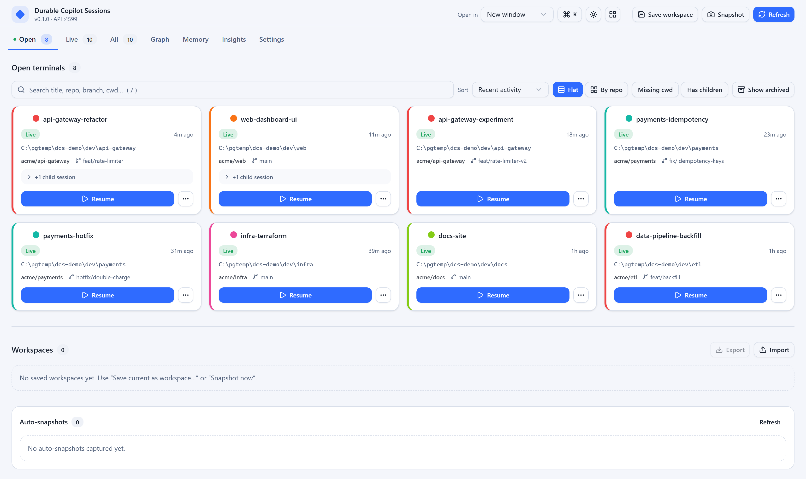
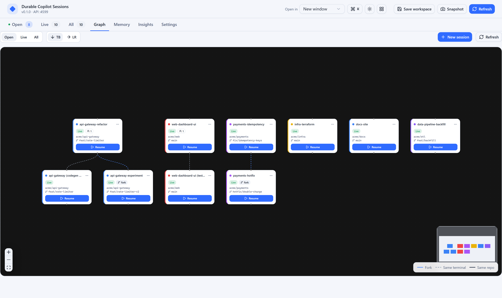
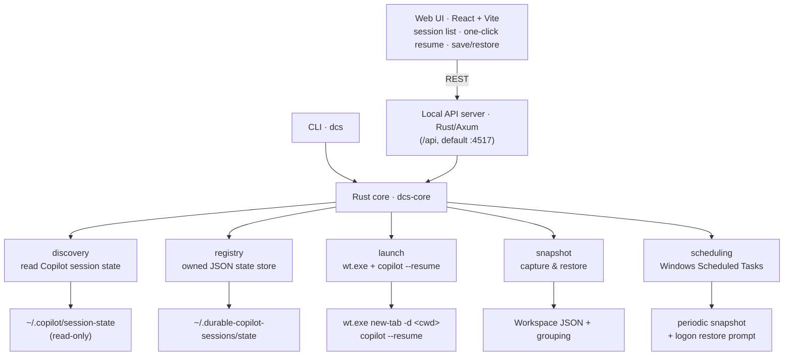

# Durable Copilot Sessions

> Save, snapshot, and one‑click **restore** your GitHub Copilot CLI sessions across Windows Terminal
> windows and tabs — durable across reboots.


---

## The problem

You run **dozens** of Copilot CLI sessions at once, each in its own Windows Terminal tab — named and
color‑coded so you can tell parallel streams of work apart at a glance. Then Windows decides it's time
for a forced restart to install updates.

When the machine comes back, **the entire live layout is gone**:

- every tab **title** you set,
- every tab **color** you assigned,
- the way tabs were **grouped into windows**, and
- the mapping of **which tab held which Copilot session**.

The good news: Copilot's *session state* survives on disk under `~/.copilot/session-state`. The bad
news: Windows Terminal's layout is volatile, and there is no built‑in way to put it all back. You're
left manually hunting for sessions and rebuilding your workspace tab by tab.

## The solution

**Durable Copilot Sessions** (`dcs`) is a local, Windows‑only tool that:

1. **Discovers** your Copilot CLI sessions by reading Copilot's own on‑disk state (read‑only).
2. **Records** durable metadata (titles, colors, window grouping) for sessions you launch or
   customize through the tool.
3. **Snapshots** your live layout on a schedule, and
4. **Restores** the exact Windows Terminal windows + tabs with one click — each Copilot session
   reattached via `copilot --resume` in its original working directory.

Because all of this state lives on disk under `~/.durable-copilot-sessions/state/`, it **survives
reboots, forced updates, and crashes**.

> The tool only ever **reads** `~/.copilot`. It never modifies Copilot's own session state.

---

## Features

- 🔎 **Auto‑discovery** of Copilot sessions — even ones you never launched through the tool — with
  live / stale / inactive status derived from `inuse.<pid>.lock` files and PID liveness checks.
- 🖱️ **One‑click resume** from the web dashboard or `dcs resume <id>`: opens a Windows Terminal tab,
  `cd`s to the session's recorded working directory, and runs `copilot --resume`.
- 💾 **Named workspaces** — `dcs save <name>` captures the current live layout; `dcs restore <name>`
  reopens every window and tab exactly as saved.
- ⏱️ **Rolling auto‑snapshots** via a Windows Scheduled Task, plus a **logon restore prompt** so a
  forced restart never costs you your layout.
- 🎨 **Color & title fidelity** for sessions managed through the tool; sensible auto‑assigned colors
  and repository‑based window grouping for everything else.
- 🌐 **Local JSON API** (Rust + Axum) that preserves the current `/api` contract for the future TUI and
  the legacy React dashboard — no cloud, no telemetry.
- 🧰 **`dcs` CLI** for everything the UI does, scriptable and CI‑friendly.
- ⚡ **Rust backend/core.** Discovery, registry, launch planning, memory/search, scheduling, CLI, and
  HTTP are implemented in Rust. The npm-linked `dcs` command delegates to `target\release\dcs-rs.exe`.

---

## Screenshots

> The dashboard and Session Graph, shown with **synthetic demo data**.

### Dashboard — open terminals at a glance



Every live Copilot session as a card: name, liveness, working directory, repo/branch,
co‑located child sessions, and one‑click **Resume**. Filter to Open / Live / All, search,
sort, group by repo, and recolor or rename inline.

### Session Graph — lineage, forks, and co‑located children



Nodes are sessions; edges show **fork lineage** and **same‑terminal** grouping. Fork, spawn a
child, or jump to related memory straight from a node.

---

## Requirements

| Requirement | Notes |
| --- | --- |
| **Windows 11** | The tool drives `wt.exe`; it is Windows‑only by design. |
| **Windows Terminal** | `wt.exe` must be on `PATH` (the default on Windows 11). |
| **Rust ≥ 1.80** | Builds the Rust `dcs-rs` backend/CLI. |
| **Node.js ≥ 20** | Used for npm setup, the thin `dcs` launcher, and the legacy React dashboard. |
| **GitHub Copilot CLI** | `copilot` must be on `PATH` so restored tabs can run `copilot --resume`. |

---

## Install

**True one-liner.** From a PowerShell prompt — clones, installs, builds, links `dcs`
onto your PATH, and registers the durability tasks, all from a single command:

```powershell
irm https://raw.githubusercontent.com/namra98/durable-copilot-sessions/main/scripts/bootstrap.ps1 | iex
```

> **Private repo?** Authenticate the fetch with the GitHub CLI instead:
>
> ```powershell
> gh api repos/namra98/durable-copilot-sessions/contents/scripts/bootstrap.ps1 -H "Accept: application/vnd.github.raw" | iex
> ```

The bootstrap script clones into the current directory (skipped if you're already
inside a checkout), runs install + build + `npm link`, then registers the
auto‑snapshot + logon‑restore Scheduled Tasks. Pass `-NoTasks` to skip the tasks.

<details>
<summary>Manual / step-by-step</summary>

```bash
git clone https://github.com/namra98/durable-copilot-sessions.git
cd durable-copilot-sessions
npm run setup     # npm install + npm run build + npm link  →  `dcs` on PATH
dcs install-tasks # register auto-snapshot + logon-restore (optional)
```

`npm run setup` builds the Rust backend/CLI in release mode, compiles the thin npm launcher,
bundles the web assets into `dist/`, and `npm link`s the `dcs` bin
(`dist/cli/rust-bin.js`) onto your PATH. Verify your environment afterward with `dcs doctor`.
</details>

---

## Quick start

**1. See what's out there.** List your discovered Copilot sessions (live ones first):

```bash
dcs list            # live + recently active sessions
dcs list --all      # include stale/inactive sessions too
```

**2. Start the local API.** The Rust API listens on `127.0.0.1:4517` by default:

```bash
dcs serve
```

The React dashboard is kept as a legacy/dev client for the frozen `/api` contract. During
development, run it against the Rust API with:

```bash
npm run dev         # Rust API on :4517, dashboard on :4516
```

**3. Resume a session** in a fresh Windows Terminal tab:

```bash
dcs resume 8f3c1a2b --title "api-refactor" --color "#3B82F6"
```

**4. Save and restore your layout:**

```bash
dcs save morning-layout --all --description "All my active work streams"
# ...later, or after a reboot...
dcs restore morning-layout
```

**5. Make it automatic.** Register the periodic snapshot + logon‑restore Scheduled Tasks:

```bash
dcs install-tasks --interval 5
```

Now your layout is captured every few minutes, and after the next forced restart you'll be prompted
to restore it. The installer does not require admin rights: the logon task is scoped to the current
Windows user, and if Windows still denies it, `dcs` installs a fallback in the current user's
Windows Startup known folder for the restore prompt instead.

---

## CLI reference

All commands are subcommands of `dcs`.

| Command | Description |
| --- | --- |
| `dcs list [--all]` | List discovered sessions (live first) with name, cwd, repo, branch, and liveness. `--all` includes stale/inactive sessions. |
| `dcs resume <sessionId> [--window new\|current] [--color <c>] [--title <t>]` | Open a Windows Terminal tab that resumes the given session in its recorded cwd. |
| `dcs save <name> [--all] [--description <d>]` | Save the current live layout as a named workspace. `--all` includes non‑top‑level sessions. |
| `dcs restore <name\|id> [--window new\|current]` | Relaunch a saved workspace's windows + tabs. |
| `dcs snapshot` | Take a rolling auto‑snapshot of the current layout (used by the Scheduled Task). |
| `dcs restore-prompt` | On logon, if a recent snapshot exists, prompt and open the UI to restore it. |
| `dcs ui` | Compatibility alias for `dcs serve`; the dashboard remains a separate legacy/dev client. |
| `dcs serve [--port <n>]` | Start the Rust API server. |
| `dcs new <title> [--cwd <dir>] [--color <c>] [--prompt <p>]` | Launch a brand‑new managed Copilot session in a Windows Terminal tab. |
| `dcs install-tasks [--interval <minutes>] [--no-hidden]` | Register the periodic snapshot task + current-user logon restore prompt. Runs hidden (no console flash) by default; `--no-hidden` shows a window. Falls back to the current user's Windows Startup known folder if Windows denies the logon Scheduled Task. |
| `dcs uninstall-tasks` | Remove the Scheduled Tasks and any Startup-folder fallback. |
| `dcs tasks-status` | Report whether snapshot, the logon Scheduled Task, and any Startup fallback are installed. |
| `dcs restore-last [--window new\|current]` | Restore the most recent auto-snapshot. |
| `dcs resume-repo <repository> [--window ...]` | Resume every open session matching a repository as one grouped window. |
| `dcs fork <sessionId> --confirm-copilot-state-write` | Fork a session (records lineage for the Graph view). Requires explicit confirmation because it creates a Copilot session-state directory. |
| `dcs recall <query...>` | Search local memory / chat history for sessions by free text. |
| `dcs reindex-memory` | Rebuild the local memory/recall index. |
| `dcs stats` / `dcs transcript <id>` / `dcs diff <workspace>` | Show usage stats, a session transcript, or a workspace-vs-live diff. |
| `dcs export-workspaces [file]` / `dcs import-workspaces <file>` | Export/import saved workspaces as JSON. |
| `dcs clean` | Report stale Copilot locks without modifying Copilot state. `--remove --confirm-copilot-state-write` deletes dead-PID lock files as an explicit escape hatch. |
| `dcs tray` | Launch the always-on system tray (Windows PowerShell, STA). |
| `dcs doctor [--json]` | Run environment health checks (wt, PowerShell, copilot, Node, state dirs, tasks). |

`--window` controls whether a relaunch targets a **new** Windows Terminal window (default) or the
**current** one.

---

## Web dashboard

`npm run dev:web` serves a React dashboard that mirrors the CLI and talks to the same Rust `/api`
contract:

- a list of **live** and **known** sessions with name, cwd, repository, branch, and liveness;
- **one‑click resume** for any session;
- **save** the current layout as a workspace and **restore** any saved workspace;
- per‑session **color / title editing** that is persisted as managed metadata so it survives the next
  reboot.

In development, Vite serves it on `:4516` and proxies `/api` to the Rust server on `:4517`. The
dashboard is intentionally not being ported as part of the backend migration; the future TUI should
consume the frozen JSON contract instead.

---

## Architecture

`dcs` now uses a Rust backend/core with an npm launcher for convenience. The old TypeScript backend,
Express server, and TypeScript CLI have been removed; the remaining TypeScript code is the dashboard
client plus the thin launcher. The primary CLI and local API run from `rust\dcs` and `rust\dcs-core`.



| Layer | Responsibility |
| --- | --- |
| `rust\dcs-core\src\discovery.rs` | Scan `~/.copilot/session-state/*/workspace.yaml`, classify liveness from `inuse.<pid>.lock` + PID checks, flag top-level interactive sessions, and (best-effort) enrich from `session-store.db`. |
| `rust\dcs-core\src\registry.rs` | Durable file-store: one JSON per managed session and one per workspace, written atomically under the owned state dir. |
| `rust\dcs-core\src\launch.rs` | Build and run `wt.exe` commands that open tabs running `copilot --resume`, applying color maps, window grouping, and cwd fallback. Argv builders are pure and unit-tested via dry-run. |
| `rust\dcs-core\src\manager.rs` | Discovery, registry/state IO, launch/snapshot planning, memory/search, logs/transcripts, stats, scheduling helpers, and manager facade. |
| `rust\dcs` | Rust CLI plus Axum API exposing sessions, workspaces, resume, snapshot, restore, memory, logs, and config. |
| `src\web` | Legacy React dashboard that talks to the API contract. |
| `src\cli\rust-bin.ts` | Thin npm launcher that locates and executes `dcs-rs`. |

See [`docs/design/overview.md`](docs/design/overview.md) for a deeper walkthrough and the on‑disk
state layout, and [`docs/design/session-graph-canvas.md`](docs/design/session-graph-canvas.md) for the
Session Graph design.

---

## How it works

### 1. Discovery

Copilot writes one folder per session under `~/.copilot/session-state/<id>/`. Each contains a
`workspace.yaml` with the session's `name`, `cwd`, `git_root`, `repository`, and `branch`. Discovery
reads these, optionally enriches them with a summary from `~/.copilot/session-store.db`, and
classifies each session's **liveness**:

| Liveness | Meaning |
| --- | --- |
| `live` | A current `inuse.<pid>.lock` exists and the PID is a running process. |
| `stale` | A lock file exists but its PID is dead (the session crashed or was killed). |
| `inactive` | No lock file; the session exists on disk but isn't open. |

Because a single PID can hold locks for several sessions (subagents), discovery also makes a
best‑effort attempt to flag **top‑level interactive** sessions — these are what `dcs save` captures by
default.

### 2. Registry

Anything the tool *owns* — your chosen titles, colors, grouping, pinned/hidden flags, and saved
workspaces — is stored as plain JSON under `~/.durable-copilot-sessions/state/`. Writes are atomic
(write‑to‑temp + rename), so an interrupted snapshot can never corrupt your registry.

### 3. Snapshot

A snapshot turns the current live layout into a durable `Workspace`: a set of windows, each holding
ordered tabs, each tab resuming one Copilot session with a title, color, and cwd. Auto‑snapshots roll
on a schedule and are pruned to `maxAutoSnapshots`.

### 4. Restore

To restore, the tool builds `wt.exe` commands from the saved `Workspace`. Each tab `cd`s to its
recorded cwd and runs `copilot --resume`. Restore is resilient to a moved working directory:

> **cwd fallback:** if a tab's recorded `cwd` no longer exists, restore falls back to the session's
> git root, then to your home directory, emitting a warning rather than failing.

---

## REST API

The Rust Axum server exposes the JSON API under the `/api` base path (default port **4517**).

| Method & path | Purpose |
| --- | --- |
| `GET /api/health` | Liveness probe for the server. |
| `GET /api/sessions?filter=open\|live\|all` | List discovered sessions (default `open`). |
| `PATCH /api/sessions/:id` | Update managed metadata (title, color, group, pinned, hidden) for a session. |
| `POST /api/sessions/:id/resume` | Resume a session in a new Windows Terminal tab. |
| `POST /api/sessions/:id/fork` | Fork a session only when the request includes `confirmCopilotStateWrite: true`. |
| `GET /api/workspaces` | List saved workspaces. |
| `POST /api/workspaces` | Save the current layout as a workspace. |
| `DELETE /api/workspaces/:id` | Delete a saved workspace. |
| `POST /api/workspaces/:id/restore` | Restore a saved workspace's windows + tabs. |
| `POST /api/snapshot` | Take a rolling auto‑snapshot now. |
| `GET /api/config` | Return the effective `AppConfig`. |

Mutating API routes reject cross-site browser requests. Browser-based clients should call the API
from a loopback origin (`localhost`, `127.0.0.1`, or `[::1]`); CLI and same-origin local clients do
not need extra headers.

---

## Configuration

Configuration is loaded from `~/.durable-copilot-sessions/state/config.json`. Any fields you omit
fall back to built‑in defaults; a missing or corrupt file is ignored and defaults are used. The
effective config is also available from `GET /api/config`.

### `AppConfig` fields

| Field | Type | Default | Description |
| --- | --- | --- | --- |
| `apiPort` | `number` | `4517` | Port for the local Rust API server. |
| `webPort` | `number` | `4516` | Port for the Vite web dev server. |
| `snapshotIntervalMinutes` | `number` | `5` | Minutes between background auto‑snapshots. |
| `maxAutoSnapshots` | `number` | `50` | Maximum number of rolling auto‑snapshots to retain. |
| `colorStrategy` | `"by-repo" \| "by-cwd" \| "rotate" \| "fixed"` | `"by-repo"` | How tab colors are auto‑assigned when you haven't chosen one. |
| `autoOpenBrowser` | `boolean` | `true` | Open the browser automatically for visible UI flows such as `restore-prompt`. |
| `windowGrouping` | `"by-repo" \| "by-cwd" \| "single"` | `"by-repo"` | How discovered sessions are grouped into windows on restore. |
| `copilotCommand` | `string` | `"copilot"` | Executable used to launch/resume a session (e.g. `"agency"` to wrap Copilot with MCP servers). |
| `copilotArgs` | `string[]` | `[]` | Extra args inserted before `--resume` (e.g. `["copilot","--mcp","workiq",...,"--yolo"]`). |
| `restoreOnLogin` | `"off" \| "prompt" \| "auto"` | `"prompt"` | Logon task behavior: do nothing, open the dashboard to review/restore, or silently auto-restore the last snapshot. |

### Example `config.json`

```json
{
  "apiPort": 4517,
  "webPort": 4516,
  "snapshotIntervalMinutes": 5,
  "maxAutoSnapshots": 50,
  "colorStrategy": "by-repo",
  "autoOpenBrowser": true,
  "windowGrouping": "by-repo"
}
```

### Environment overrides

These environment variables override paths and ports (handy for tests and CI):

| Variable | Effect |
| --- | --- |
| `DCS_STATE_DIR` | Override the owned state directory (default `~/.durable-copilot-sessions/state`). |
| `DCS_COPILOT_HOME` | Override the Copilot home read from (default `~/.copilot`). |
| `DCS_API_PORT` | Override the API port for the Vite dev proxy. |
| `DCS_WEB_PORT` | Override the Vite dev server port. |
| `DCS_LOG_LEVEL` | `debug` \| `info` \| `warn` \| `error` (default `info`). |

### On‑disk state layout

```
~/.durable-copilot-sessions/state/
├── config.json                  # AppConfig (this file)
├── registry/
│   ├── sessions/                # one ManagedSession JSON per customized session
│   └── workspaces/              # one Workspace JSON per saved layout
├── snapshots/                   # rolling auto-snapshots (pruned to maxAutoSnapshots)
├── launch-scripts/              # generated shell scripts wt.exe runs per tab
└── logs/                        # api-YYYY-MM-DD.log (JSON lines)
```

---

## Limitations

These are honest, by‑design trade‑offs — read them before relying on the tool.

- **No live‑tab introspection.** Windows Terminal exposes **no API** to read a live tab's color,
  title, or window grouping. Full‑fidelity "exact" restore therefore relies on metadata the tool
  records when you launch or customize a session **through** the tool (`dcs new`, `dcs resume`, or
  editing in the dashboard).
- **Auto‑discovered sessions restore approximately.** Sessions you never touched through the tool
  restore with their **name + cwd** and an **auto‑assigned color**, grouped into windows by
  **repository** by default. The exact original colors/titles of manually‑created tabs that predate
  tool adoption cannot be recovered.
- **Resume is cwd‑scoped.** Copilot's resume picker is scoped to a working directory, so each restored
  tab `cd`s to the session's recorded `cwd` before `copilot --resume`. If that cwd no longer exists,
  restore falls back to the git root, then the home directory, with a warning.
- **Read‑only on Copilot state.** The tool only **reads** `~/.copilot`; it never writes Copilot's
  state. It does not capture or replay Copilot conversation content — Copilot already persists that,
  and `dcs` only re‑attaches to it.
- **Windows‑only.** The tool drives `wt.exe`, so it is Windows‑only by nature.

---

## Development

Common scripts (see [`package.json`](package.json)):

| Script | What it does |
| --- | --- |
| `npm run dev` | Run the Rust API and the Vite dashboard concurrently. |
| `npm run dev:api` | Run just the Rust API via `cargo run -p dcs-rs -- serve`. |
| `npm run dev:web` | Run just the Vite dev server. |
| `npm run build` | Build the Rust release binary, TypeScript compatibility code, and web bundle. |
| `npm run build:rust` | Build `target\release\dcs-rs.exe`. |
| `npm run build:node` | Compile the Node/CLI/server code with `tsc`. |
| `npm run build:web` | Bundle the React dashboard with Vite. |
| `npm run typecheck` | Type‑check both the Node and web TypeScript projects (`--noEmit`). |
| `npm run lint` | Run ESLint across the repo. |
| `npm test` | Run the Vitest suite once. |
| `npm run rust:check` | Run Rust fmt, clippy, tests, and debug build. |
| `npm run rust:smoke` | Run the Rust large-session discovery smoke test. |
| `npm run smoke:launcher` | Run the built npm `dcs` launcher and verify it can find the Rust binary. |
| `npm run test:watch` | Run Vitest in watch mode. |
| `npm run cli -- <args>` | Run the Rust CLI from source via Cargo (e.g. `npm run cli -- list`). |

### Conventions

- **Rust first** for backend/core changes. Keep unsafe code forbidden and preserve serde field names
  that are part of `contracts/backend-api.v1.json`.
- **TypeScript ESM** remains for compatibility tests and the dashboard. Relative imports use
  **`.js`** extensions (e.g. `import { loadConfig } from "./config.js"`), and constructor parameter
  properties are disallowed.
- **Tests live near source**: Rust tests under `rust/**/tests` and TypeScript tests as `*.test.ts`.
- **Contract preservation.** Update fixtures/contracts deliberately before changing API or state shape.

See [`AGENTS.md`](AGENTS.md) for the full contributor/agent guide.

### Project layout

```
rust/
├── dcs-core/     # backend/domain library: discovery, registry, launch, snapshots,
│   │             # memory/search, scheduling, doctor, manager facade
│   └── src/model.rs # serde API/state contract models
└── dcs/          # `dcs-rs` CLI and Axum API server

src/
├── web/          # React + Vite dashboard client
└── cli/          # thin npm launcher that delegates to Rust
```

---

## License

Private. © the project authors. All rights reserved.
